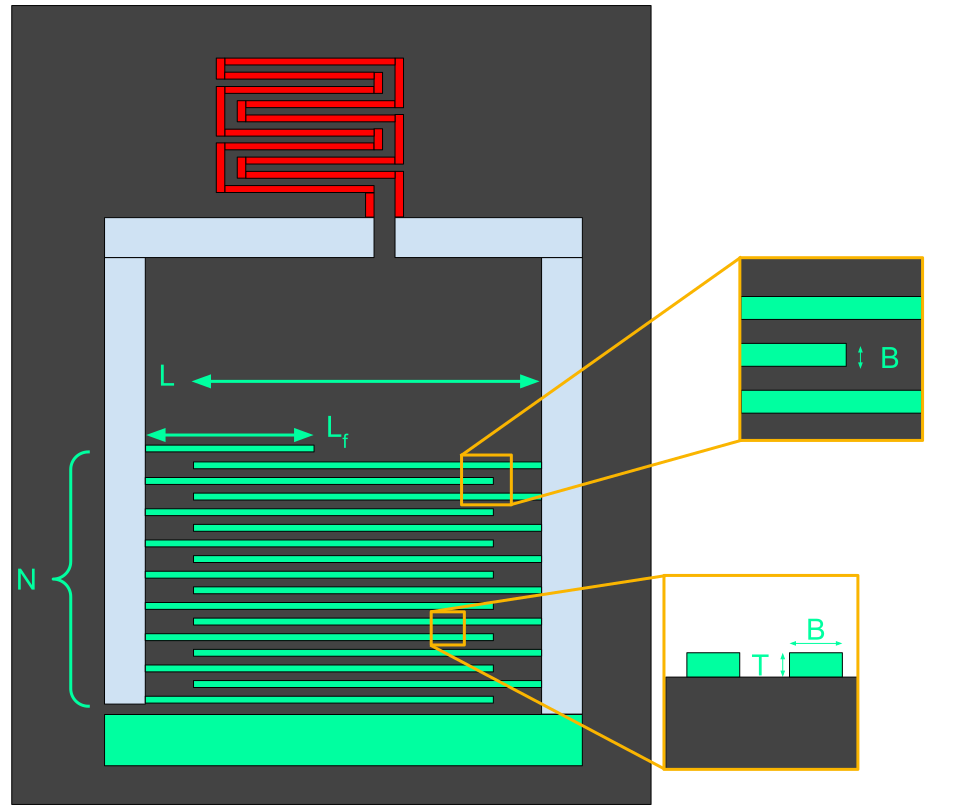

# MKID Sonnet Variation
This is a project to create automated variations of MKID designs using Python to create Sonnet Geometries.

*Schematic of an MKID resonator. Shown in green is the interdigitated capacitor and shown in red is the meandering inductor. The software presented here generates Sonnet geometries with specificied values or variations in the identified parameters.*

## How to use
This tool generates MKID geometries based on command line inputs.  It is currently in active development. Due to this, the internal documentation is the best route to read how to use it. To access the internal help, enter

`python3 gen_mkids.py -h` or `python3 sonnet_csv_reader.py -h`

## Publications
[A poster](LTD_OC_2025.pdf) describing the initial version of this software was presented at the Low Temperature Detectors conference on $3^{rd}$ June 2025.

## Acknowledgements
A template by Cathal McAleer is used as the base geometry. 

See [McAleer, Cáthal, et al. "Automation of MKID Simulations for Array Building with AEM (Automated Electromagnetic MKID Simulations)." Journal of Low Temperature Physics (2024)](https://link.springer.com/article/10.1007/s10909-024-03103-3) for AEM, a related tool for generation of MKID resonator designs to meet specific frequency and quality factor requirements.

This project relies on the `os`, `numpy`, `decimal`, `pandas` and `argparse` libraries.

Outputs from this software require the use of [Sonnet software](https://www.sonnetsoftware.com/) to process.
